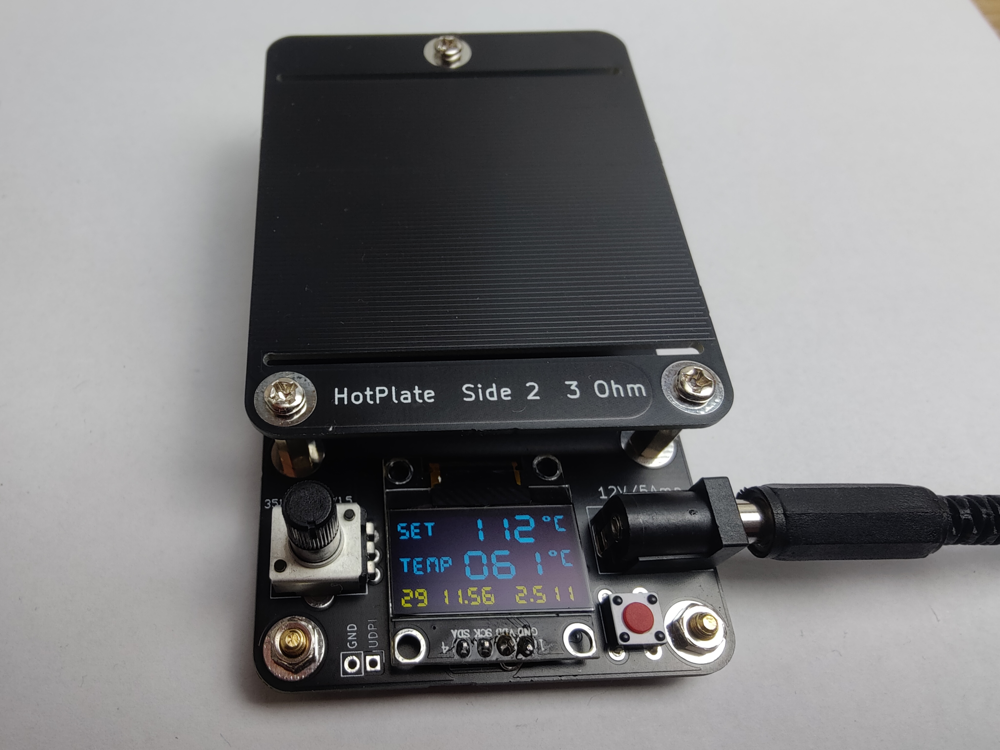

# HotPlate

Cheap DIY solution to make a heater for hot-plate soldering.

## Operating instructions

1. Plug the device to a common 12V DC power source that is able to provide 5 ampere.
2. Place the object to be soldered on the heater plate.
3. Switch on the heater with the red power button.
4. Select a target temperature (the "Set" value on the display) with the potentiometer.
5. When the solder is molten enough, turn off the heater with the red button. Note that
there is no support to automatically follow a temperature profile.

## Data shown on the display

* Set: Selected target temperature
* Temp: Temperature as measured

The numbers in the bottom area are used to understand the internal working and show the 
following things: 
* Duty cycle of the heater
* Supply voltage 
* Current through the top heater trace

## Theory of operation

The heater plate contains two copper traces (one at the top and one at the bottom) that can individually
be connected to the supply voltage. These traces have a resistance of about 3.5 ohm each (within
manufacturing tolerances) and will produce the heat for the process. For fine control of the output power,
the controller circuit will quickly turn each heater trace on and off.

To receive feeedback about the current temperature, the controller circuit contains a Hall-effect sensor
to monitor the electric current running through the top heater trace. Combined with the 
voltage that is also monitored, the resistance of this trace can be computed. As the specific resistance of
copper changes with temperature, the current temperature can be computed. 

Note that due to tolerances in PCB manufacturing and in the electronic parts, the temperature measurement
may be not very precise. You will need to experimentally find the best temperature setting for your specific application.

## Replacement heater plate

The repeated thermal stress on the heater will probably cause it to get damaged eventually. In this case
it is quite easy to have a replacement PCB made using the [Gerber files](heater/gerber/heater_rev1.zip).
As you will probably get multiple parts from your manufacturer, this should then last for a considerable 
time. 
You can also just turn over the heater plate if the top surface gets scratched or is otherwise worn out,
so you can continue to use it.
